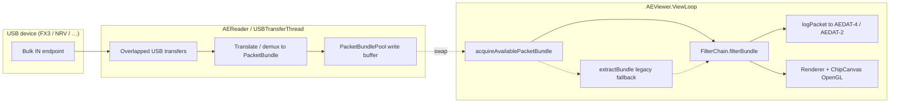
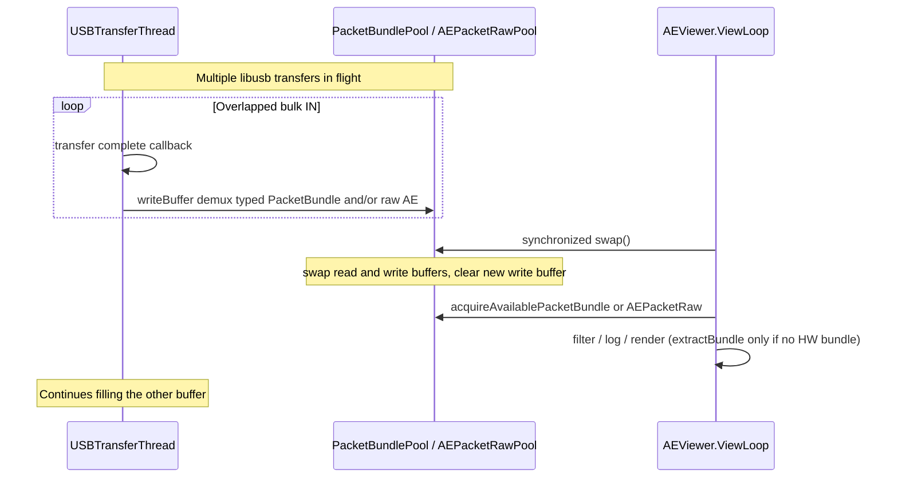
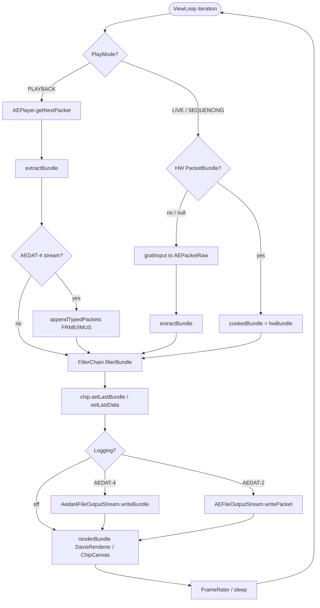
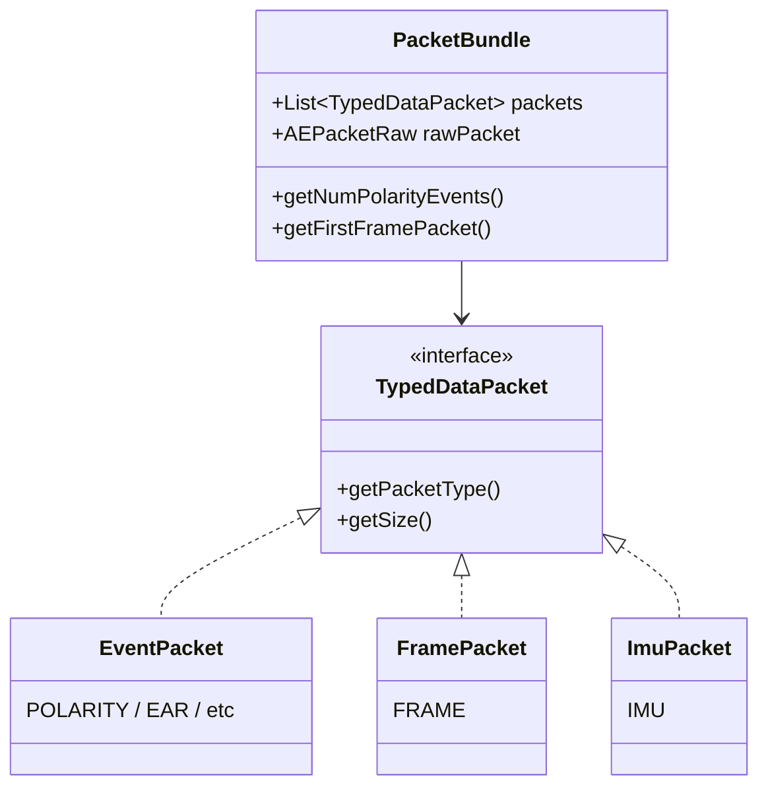
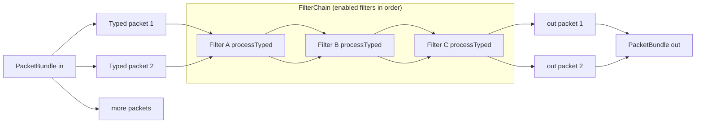
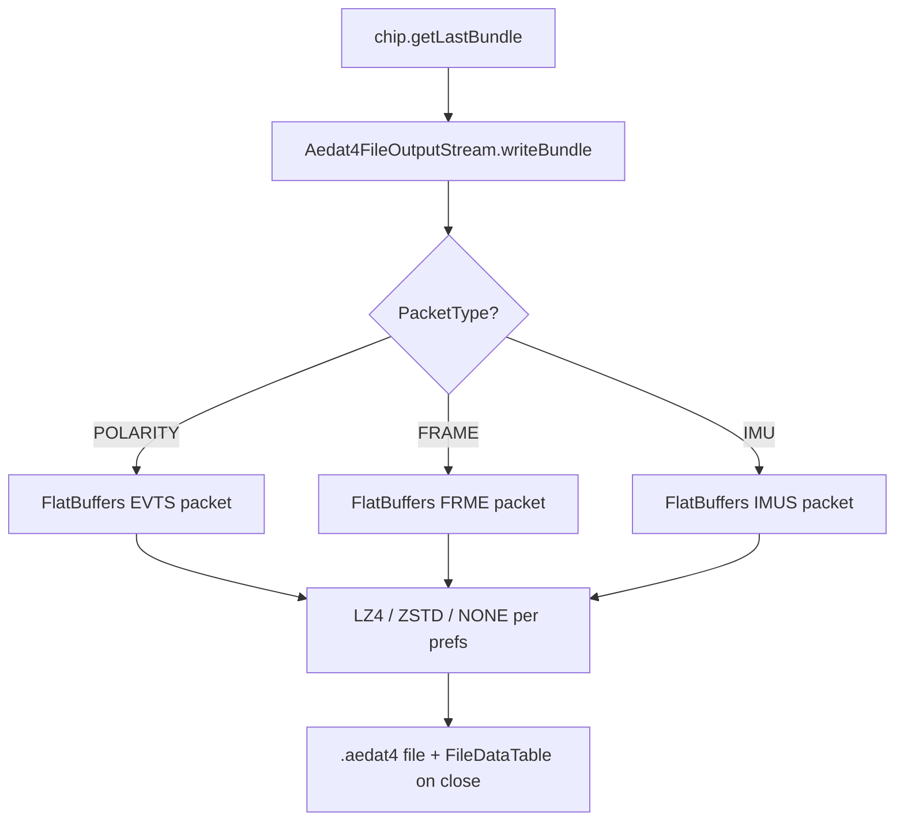

# jAER 3 — Event processing pipeline

This document summarizes how live sensor data and recorded files move through
**jAER 3** (`jaer3` / `master` after the PacketBundle refactor): from USB
capture, through typed packets and `EventFilter`s, to OpenGL display and optional
AEDAT-4 logging.

The central idea in jAER 3 is that one **timeslice** is a
[`PacketBundle`](../src/net/sf/jaer/event/PacketBundle.java): an ordered list of
homogeneous typed packets (polarity, APS frames, IMU, …) rather than one mixed
`ApsDvsEventPacket`.

---

## High-level data flow



**Primary threads**

| Thread | Role |
|--------|------|
| `USBTransferThread` / `AEReader` | Submits multiple bulk IN transfers; callback parses bytes into the **write** side of a double buffer |
| `AEViewer.ViewLoop` | Game loop: acquire → extract/filter → log → render → pace FPS |
| AWT Event Dispatch (EDT) | UI, menus, bias controls (must not block on USB open/close) |
| JOGL / display | ChipCanvas paints; often driven by `paintFrame` / `repaint` from ViewLoop |

---

## Overlapped USB I/O and double buffering

**Target live path** (migrated chips): USB decode fills a typed
[`PacketBundle`](../src/net/sf/jaer/event/PacketBundle.java) via
[`PacketBundlePool`](../src/net/sf/jaer/event/PacketBundlePool.java);
ViewLoop calls `acquireAvailablePacketBundle()` and **skips**
`extractBundle`. Prefs kill-switches restore raw+extract for validation
(see [usb-live-acquisition-bench.md](usb-live-acquisition-bench.md)).

**Legacy live / file / network path:**
[`AEPacketRawPool`](../src/net/sf/jaer/aemonitor/AEPacketRawPool.java) still
holds packed address+timestamp AEs. [`AEPacketRaw`](../src/net/sf/jaer/aemonitor/AEPacketRaw.java)
and chip `extractPacket` / `extractBundle` remain for AEDAT-2, network AE,
sequencers, playback of AEDAT-2, and unmigrated chips — not deleted.



| Family | USB typed demux | Pref (under `hardware/`) |
|--------|-----------------|--------------------------|
| Davis FX3 / SciDVS (same PID) | Polarity + Frame + IMU | `DAViSFX3/usbTypedDemux` (RGB color stays legacy) |
| NRV | Polarity | `NRV/usbTypedDemux` |
| Prophesee EVK4 | Polarity | `Prophesee/usbTypedDemux` |
| DVS128 libusb FX2 | Polarity + sync special | `CypressFX2DVS128.usbTypedDemux` |

When demux is active on Davis, APS/IMU synthetic AEs are **not** dual-written
into `AEPacketRaw` by default (`DAViSFX3/dualWriteApsImuAe=false`) — the largest
live memory win under APS+DVS.

**Overrun:** if the USB thread fills the write buffer before ViewLoop swaps, the
pool sets `overrunOccuredFlag` (lost events). Increase AE buffer size (Control →
rendering AE buffer size) for high-rate sensors such as NRV.

---

## ViewLoop processing (one frame)



Relevant code: `AEViewer.ViewLoop.run()` in
[`AEViewer.java`](../src/net/sf/jaer/graphics/AEViewer.java).

---

## Typed packets and PacketBundle



One ViewLoop timeslice may contain several packets in time order, e.g.
`POLARITY` → `IMU` → `POLARITY` → `FRAME`. Filters and renderers consume the
bundle as a unit.

---

## EventFilters (`FilterChain`)

[`FilterChain.filterBundle`](../src/net/sf/jaer/eventprocessing/FilterChain.java)
walks each typed packet through every **enabled** filter. Each
[`EventFilter2D`](../src/net/sf/jaer/eventprocessing/EventFilter2D.java) declares
`accepts(PacketType)`:

- Polarity denoisers typically accept `POLARITY` only — frames and IMU pass
  through unchanged.
- Filters that want IMU or frames opt in via `accepts`.



Legacy path: `filterPacket(EventPacket)` still exists for older call sites and
`FILTER_INPUT` mode; live ViewLoop prefers `filterBundle`.

---

## Rendering / OpenGL

After filtering:

1. `chip.setLastBundle(cookedBundle)` / `setLastData(polarity packet)`.
2. `renderBundle` → chip renderer (`DavisRenderer`, etc.) updates event maps /
   frame textures from typed packets.
3. `ChipCanvas.paintFrame()` or `repaint()` draws via JOGL.

Rendering can be **skipped** adaptively under load (`packetLevelRenderSkipping`)
when no filters need every packet and AVI sync recording is not active; logging
of raw data can still occur on the skip path.

---

## Saving to AEDAT-4

When logging is enabled in LIVE (or playback with logging), ViewLoop calls
`logPacket` each slice:



- Default logging format can be AEDAT-4; compression is chosen in preferences
  (`Aedat4Compression`).
- On close, the writer logs an estimate such as
  `compressed to XX% of raw (payload … → …)` comparing uncompressed FlatBuffer
  payloads to compressed sizes.
- AEDAT-2 path still writes reconstructed or raw `AEPacketRaw` via
  `AEFileOutputStream`.

**Playback** of AEDAT-4 uses a **sparse packet index** (file offsets + time
bounds + event counts), not a full per-event RAM dump. Polarity is decoded
on demand for the current timeslice; FRME/IMUS are injected via
`appendTypedPackets`.

---

## Sources of input (PlayMode)

| Mode | Input path |
|------|------------|
| `LIVE` | USB `acquireAvailablePacketBundle` or raw acquire + extract |
| `PLAYBACK` | `AEPlayer` → `AEFileInputStream` / `Aedat4FileInputStream` |
| `FILTER_INPUT` | Feedback from filters generating events |
| `REMOTE` / sockets | Network AE streams |
| `SEQUENCING` | Hardware sequencer |

File open pauses live acquisition and suppresses USB reopen on the EDT so
ViewLoop does not fight the open dialog (`beginFilePlaybackOpen` /
`suppressHardwareOpen`).

---

## Mental model (ASCII)

```
  Sensor ──USB bulk──► [XFER][XFER][XFER]  (USBTransferThread)
                              │
                              ▼
                     AEPacketRawPool write[]
                              │  swap()
                     AEPacketRawPool read[]  ◄── ViewLoop
                              │
                     PacketBundle (typed)
                              │
                     FilterChain.filterBundle
                              │
              ┌───────────────┼───────────────┐
              ▼               ▼               ▼
           Renderer      AEDAT-4 log      Network/AVI/…
           OpenGL
```

---

## USB VID/PID and AEChip auto-offer

Libusb factories register `(VID, PID) → HardwareInterface` classes in
[`UsbHardwareRegistry`](../src/net/sf/jaer/hardwareinterface/usb/UsbHardwareRegistry.java).
AEChip classes may optionally declare the same IDs with `@UsbDevices` /
`@UsbDevice` (inherited), for example on `DavisBaseCamera` or a unique camera
class such as `NRVS5KRC1S`.

When a single USB device is available and the viewer has no open interface
(startup or hot-plug),
[`LiveDeviceChipDetector`](../src/net/sf/jaer/hardwareinterface/usb/LiveDeviceChipDetector.java)
matches that device against the AEChip menu. AEViewer then:

- if a **Remember this selection** mapping exists for `{vid:pid[#serial]}` and is
  still a valid match, applies that AEChip silently;
- binds without prompting if the current chip is the **sole** VID/PID match;
- offers Yes / Remember / No when exactly one menu chip matches but differs from current;
- offers a chooser (OK / Remember this selection / Cancel) when several chips share
  the PID (typical for Davis FX3) — USB cannot distinguish e.g. Davis346 red vs blue;
- without Remember, prompts at most once per device key per session.

Remembered mapping prefs key: `AEViewer.liveChipOffer.chip.<deviceKey>` → AEChip FQCN.

To support a new camera chip, register its VID/PID in the appropriate
hardware-interface factory (which also updates the registry) and annotate the
AEChip:

```java
@UsbDevices({
    @UsbDevice(vid = MyHardwareInterface.VID, pid = MyHardwareInterface.PID)
})
public class MyCamera extends AETemporalConstastRetina { ... }
```

Generic playback-only chips (e.g. `DVS640`) omit `@UsbDevices` and are ignored
by live matching.

---

## Hardware Configuration Save / Load

Biasgen **Hardware Configuration → Save / Save settings as…** exports the chip
preferences node `/jaer/chips/<ChipSimpleName>` (see
[`Biasgen.exportPreferences`](../src/net/sf/jaer/biasgen/Biasgen.java)).

First-use UX flags on that node are **not** written into the XML:

- `defaultPreferencesWereLoaded`
- `firstHardwareUseHandled`

Those keys stay local so a saved/shared settings file does not suppress the
first-use load / Hardware Configuration offer for other users. Remembered live
chip mappings (`AEViewer.liveChipOffer.chip.*`) live under `/jaer/AEViewer` and
are outside Biasgen export entirely.

Shipped defaults under [`deviceSettings/`](../deviceSettings/) use the same
`/jaer/chips/<Chip>` tree (not legacy Java package paths).

**Load** warns if the XML preference node does not match the current AEChip
(prefs import follows the path in the file, so a mismatch usually does not
update the active chip). The user can cancel or load anyway.

---

## Key classes (quick index)

| Area | Classes |
|------|---------|
| Loop | `AEViewer.ViewLoop`, `AEPlayer` |
| USB | `CypressFX3`, `DAViSFX3HardwareInterface`, `NRVHardwareInterface`, `NRVAEReader`, `USBTransferThread` |
| USB match | `UsbHardwareRegistry`, `LiveDeviceChipDetector`, `@UsbDevices` |
| Buffers | `AEPacketRawPool`, `PacketBundlePool`, `AEPacketRaw` |
| Typed data | `PacketBundle`, `PacketType`, `FramePacket`, `ImuPacket`, `EventPacket` |
| Extract | `EventExtractor2D.extractBundle`, `DavisUsbPacketBundleBuilder` |
| Filters | `FilterChain`, `EventFilter2D` |
| Render | `AEChipRenderer`, `DavisRenderer`, `ChipCanvas` |
| Files | `Aedat4FileOutputStream`, `Aedat4FileInputStream`, `AEFileOutputStream` |

---

## Related docs

- [CDAVIS_GPU_DEMOSAIC.md](CDAVIS_GPU_DEMOSAIC.md) — GPU demosaic / color display path (orthogonal to PacketBundle).
