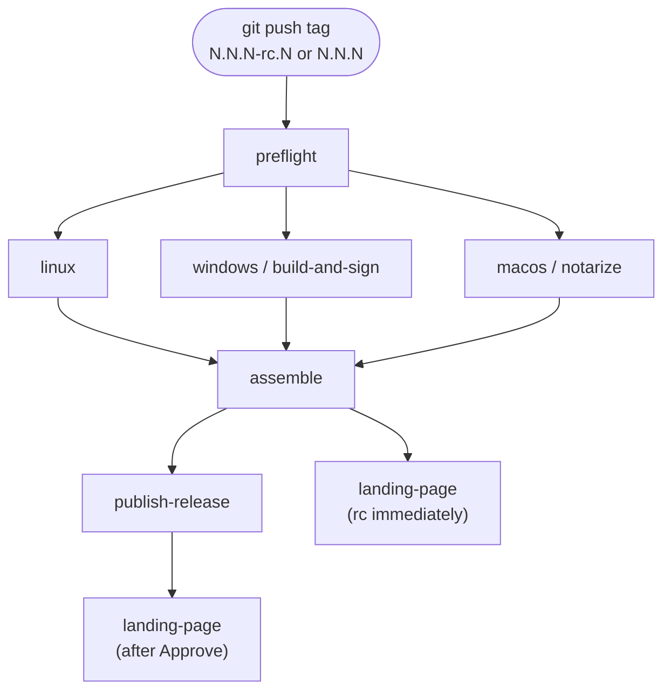
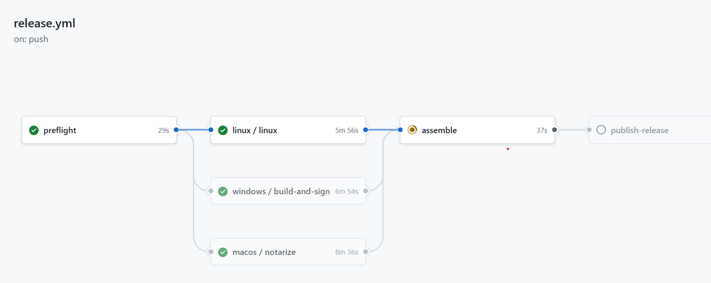

# Releasing jAER

Production installers are built on **GitHub-hosted runners** when you **push a git tag**. There is no Mini, no SSH, and no `ant release`. Do **not** `gh workflow run` [`.github/workflows/release.yml`](../.github/workflows/release.yml) on `master`.

| What users get | Where | Who writes it |
|----------------|-------|----------------|
| Installers + sample zip | [GitHub Releases](https://github.com/SensorsINI/jaer/releases) (`/releases/latest/download/…` after Latest) | `release.yml` assemble (and copy of the zip from [`sample-data-current`](https://github.com/SensorsINI/jaer/releases/tag/sample-data-current)) |
| In-app updater descriptor | [`updates.xml`](../updates.xml) on `master` | `publish-release` job (public tags only) |
| Download page | [jaerproject.org](https://jaerproject.org) | [GitHub Pages](../.github/workflows/pages.yml) from [`website/`](../website/) — [DNS](../website/README.md). Install steps: [jaerproject.org/install/](https://jaerproject.org/install/) |

`updates.xml` `baseUrl` is always `https://github.com/SensorsINI/jaer/releases/latest/download/`. The in-app checker reads that file on `master`, then downloads `baseUrl` + `fileName`. **Latest** and `updates.xml` must move together (the Approve step below).

## Pipeline

Pushing a tag that matches `N.N.N` or `N.N.N-rc.N` (no `v` prefix) runs [Release](https://github.com/SensorsINI/jaer/actions/workflows/release.yml):





`publish-release` is **skipped** on `-rc` tags (grey node). On a **public** tag it waits for you to **Approve** GitHub Environment [`publish-release`](https://github.com/SensorsINI/jaer/settings/environments).

| Job | Runner | What | Details |
|-----|--------|------|---------|
| preflight | ubuntu | `VERSION.txt` matches the public version of the tag; [`release-notes/jaer-<public>-release-notes.md`](../release-notes/) exists | [release.yml](../.github/workflows/release.yml) |
| linux | ubuntu-latest | unsigned `.sh` | [build-linux.yml](../.github/workflows/build-linux.yml) |
| windows | windows-latest | Azure-signed `.exe` (publisher **Tobias Delbruck**) | [build-win-sign.yml](../.github/workflows/build-win-sign.yml), [Azure Artifact Signing](../packaging/azure-artifact-signing.md) |
| macos | macos-latest | notarized Intel + Apple Silicon `.dmg` | [build-macos-notarize.yml](../.github/workflows/build-macos-notarize.yml), [macOS notarization](../packaging/macos-notarization.md) |
| assemble | ubuntu | attaches four installers + copies `jaer-sample-data.zip`; **rc** → published **prerelease** (not Latest); **public** → **draft** | needs [sample-data-current](https://github.com/SensorsINI/jaer/releases/tag/sample-data-current) |
| publish-release | ubuntu | writes `updates.xml` to `master`, then `--latest` | skipped on `-rc`; [Environment](https://docs.github.com/en/actions/how-tos/deploy/configure-and-manage-deployments/manage-environments) `publish-release` |
| landing-page | ubuntu | queues [Deploy landing page](https://github.com/SensorsINI/jaer/actions/workflows/pages.yml) on `master` (rebakes `latest.json` for [jaerproject.org](https://jaerproject.org)) | after assemble on **rc**; after Approve on **public**. Needed because `GITHUB_TOKEN` does not fire Pages’ `release: published` |

install4j project: [`install4j/README.md`](../install4j/README.md) / [`jaer.install4j`](../install4j/jaer.install4j). JDK **25**.

## Each new public version (example: 3.5.2)

Work on `master`. `VERSION.txt` is the **public** number (`3.5.2`), never `3.5.2-rc.0`.

1. **Notes** — add [`release-notes/jaer-3.5.2-release-notes.md`](../release-notes/jaer-3.5.2-release-notes.md) (name must be `jaer-<public>-release-notes.md`). Link install steps to [jaerproject.org/install/](https://jaerproject.org/install/); do not paste the OS how-to again. Commit and push `master`.
2. **Version** — set [`VERSION.txt`](../VERSION.txt) to `3.5.2`. Commit and push `master`.
3. **Sample zip** — only if recordings changed, or the durable Release is missing. On a box that has `sampleData/*.aedat4`:

   ```text
   ant upload-sample-data-current
   gh release view sample-data-current
   ```

   Full pack/Help-menu notes: [`README-sample-data.md`](README-sample-data.md). Never mark that Release Latest.
4. **Candidate tag** — annotated, on the commit you want testers to run:

   ```text
   git tag -a 3.5.2-rc.0 -m "jAER 3.5.2-rc.0"
   git push origin 3.5.2-rc.0
   ```

5. **Watch** [Release](https://github.com/SensorsINI/jaer/actions/workflows/release.yml) until assemble is green (~10 min). Assets land on [the prerelease](https://github.com/SensorsINI/jaer/releases/tag/3.5.2-rc.0): `jAER_windows-x64_3_5_2.exe`, `jAER_macos_3_5_2.dmg`, `jAER_macos_aarch64_3_5_2.dmg`, `jAER_unix_3_5_2.sh`, `jaer-sample-data.zip`. **Refresh jaerproject.org** then queues [Deploy landing page](https://github.com/SensorsINI/jaer/actions/workflows/pages.yml); **Download Prerelease** should show this rc.
6. **Test** those installers (GitHub prerelease or jaerproject.org). Latest and in-app update stay on the previous public release until step 9.
7. **Bugs** — fix on `master`, then a **new** tag `3.5.2-rc.1` (never move `3.5.2-rc.0`). Repeat 4–6.
8. **Promote** the winning SHA (same commit as the rc you keep):

   ```text
   git rev-parse 3.5.2-rc.0
   git tag -a 3.5.2 <that-sha> -m "jAER 3.5.2"
   git push origin 3.5.2
   ```

   Wait for assemble (Release is a **draft**).
9. **Approve** Environment [`publish-release`](https://github.com/SensorsINI/jaer/settings/environments) on that run. That job commits `updates.xml` and sets GitHub **Latest**. Check [Releases](https://github.com/SensorsINI/jaer/releases), in-app **Help → Check for updates**, and [jaerproject.org](https://jaerproject.org).
10. **Do not submit winget or Homebrew for 3.5.** This line stays GitHub Releases + [jaerproject.org](https://jaerproject.org/) + OS installers. First public `wingetcreate submit` / `SensorsINI/homebrew-jaer` is **3.6**, after that tag is Latest (hashes from the public-tag exe and DMGs, not an rc). Linux `.deb` waits until after 3.5 and is not in the 3.6 winget/Homebrew ship. Details: [`packaging/winget/README.md`](../packaging/winget/README.md), [`packaging/homebrew/README.md`](../packaging/homebrew/README.md).

## Tags are immutable

- **Never** delete, move, or retag `N.N.N` or `N.N.N-rc.N`. A bad candidate is a new `-rc.N`. A bad public release is `N.N.(N+1)` from a new SHA.
- Do not tag an old public version that already exists (for example do not tag `3.5.0` again).
- Do not use `ant create-draft-release` for this pipeline (it tags `VERSION.txt` as a public number).

## OS dry runs (no GitHub Release)

Artifacts only. Safe while Latest is still an older version:

```text
gh workflow run build-macos-notarize.yml
gh workflow run build-linux.yml
gh workflow run build-win-sign.yml
```

Local unsigned smoke (existing `dist/jAER.jar`): `ant install4j-win` / `install4j-linux` / `install4j-macos`. Output is gitignored `currentInstallers/<VERSION.txt>/`. See [`install4j/README.md`](../install4j/README.md).

## Later / backup

| Task | Link |
|------|------|
| Change recordings after a release | [`README-sample-data.md`](README-sample-data.md) — `ant upload-sample-data-current`, then a new `-rc` so assemble copies the new zip |
| Drop old GitHub assets | [`scripts/prune-old-release-assets.ps1`](../scripts/prune-old-release-assets.ps1) |
| Homebrew cask | [`packaging/homebrew/README.md`](../packaging/homebrew/README.md) |
| winget | [`packaging/winget/README.md`](../packaging/winget/README.md) |
| Windows SignPath (backup, not production) | [`.github/workflows/sign-windows-test.yml`](.github/workflows/sign-windows-test.yml) |
| Mini notarization fallback | [`packaging/macos-notarization.md`](../packaging/macos-notarization.md) |

Do **not** `ant upload-installers` over a Release that `release.yml` already filled. Do **not** `ant upload-installers-clobber-windows` after Azure has signed.
